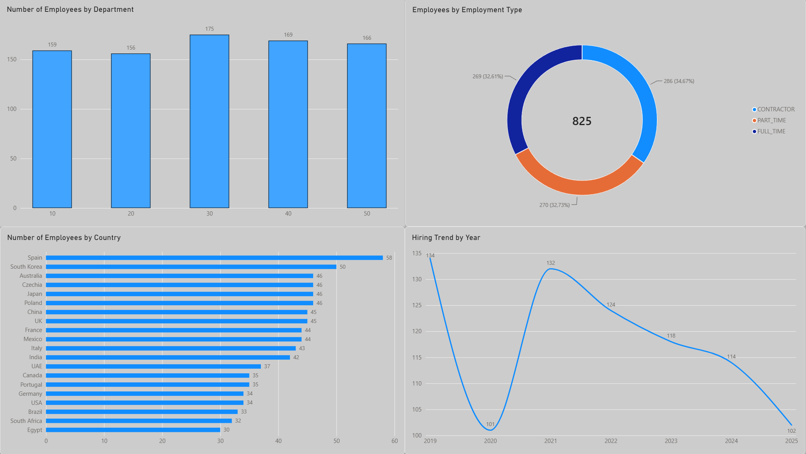

# People Data Pipeline - Microsoft Fabric

This is my Data Engineering portfolio project built around employee data.

The main goal was to build a simple end-to-end pipeline using Azure and Microsoft Fabric and understand how the different parts work together.

The project uses Python, PySpark, SQL, ADLS Gen2, OneLake and Fabric Lakehouses.

## How the project works

The source data is generated in Python and saved as a CSV file.

The general flow looks like this:

Python generator
      ↓
Azure ADLS Gen2
      ↓
OneLake Shortcut
      ↓
Bronze
      ↓
Silver
      ↓
Gold

I also created a Fabric pipeline which runs the notebooks in the correct order.

bronze_ingestion
      ↓
Wait
      ↓
silver_validation
      ↓
Wait
      ↓
gold_reporting

The Wait steps are there because I am currently using Fabric Trial capacity. Without them I was sometimes getting Spark capacity errors when the next notebook tried to start too quickly.

## Data generator

employees_generator.py

The generator creates 1000 employee records.

I intentionally added some bad data so I could practice data validation later in the pipeline.

Examples include missing emails, invalid salaries, duplicate employee IDs, missing countries, invalid dates and unknown employee statuses.

## Bronze

bronze_ingestion_fabric.py

Bronze loads the raw CSV from ADLS Gen2 through a OneLake Shortcut.

At this stage I keep the source data mostly unchanged and add basic ingestion information such as:

_ingested_at

_source_file

The data is then saved as a Delta table.

## Silver

silver_validation_fabric.py

This is where most of the data quality work happens.

I check things like salary, status, country, email and hire date.

I also remove older duplicate employee records using Window and row_number().

After validation the records are split into:

employees_clean

employees_rejected

employees_excluded

Result from the latest run:

| Metric | Records |
| --- | ---: |
| Source | 1000 |
| Latest after deduplication | 979 |
| Older duplicates | 21 |
| Clean | 825 |
| Rejected | 154 |
| Total | 1000 |

I added reconciliation checks to make sure no records disappear during processing.

## Gold

gold_reporting_fabric.py

Gold uses the clean Silver data and creates summary tables for reporting.

At the moment I have summaries based on things like department, country, employment type and employee status.

## Power BI Dashboard

I used the Gold tables to build a simple Power BI dashboard in Microsoft Fabric.

The dashboard shows:
- number of employees by department
- number of employees by country
- employment type distribution
- hiring trend by year

## Fabric pipeline

The notebooks are also connected in a Microsoft Fabric Data Pipeline.

The order is:

Bronze → Silver → Gold

Silver only starts if Bronze succeeds, and Gold only starts if Silver succeeds.

The full pipeline has been tested successfully.

## Technologies used

Python, PySpark, Spark SQL, Microsoft Fabric, Azure ADLS Gen2, OneLake, Delta tables and GitHub.

# Patryk Latek
Junior Data Engineer portfolio project
